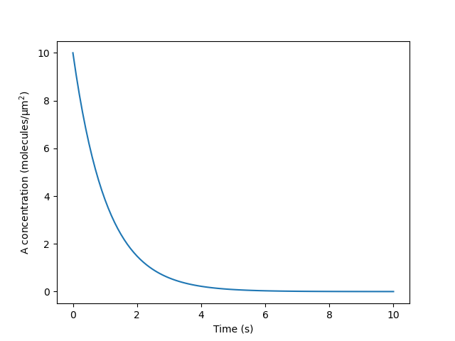

# Getting started with SMART

The basic SMART workflow is summarized in the diagram below. This is the general sequence of events followed in all of the SMART demos, which introduce applications of the software at increasing levels of complexity. Examples 1 and 2 give 2-dimensional cases, whereas examples 3-6 give increasingly complicated 3-dimensional cell signaling models.


To use SMART, the user should plan to write a python script (or Jupyter notebook) that goes through the outlined steps. The easiest way to get started with this is to follow the template of the SMART demo Jupyter notebooks or .py files. In the `smart` and `smart-lab` images, these files exist in the `/repo/examples` folder.

Here, we walk through a minimal example demonstrating the use of SMART. In this simple example, the only required imports are `smart` and `dolfin`:
```python
import smart
import dolfin
```
It is also helpful to define some units to be used in defining SMART objects. Here, we define a unit for the diffusion coefficient and for the concentration of a molecular species per unit surface area.
```python
D_unit = smart.units.unit.um**2 / smart.units.unit.s
conc_unit = smart.units.unit.molecule / smart.units.unit.um**2
```
Following these preliminary steps, we begin the basic workflow of SMART:
1. **Initialize SMART containers**: Each container (species, compartments, reactions, or parameters) is initialized by first creating individual objects of the class `smart.model_assembly.Species`, `smart.model_assembly.Compartment`, `smart.model_assembly.Reaction`, `smart.model_assembly.Parameter`. The initialization of these objects is described in some detail in Examples [1](https://rangamanilabucsd.github.io/smart/examples/example1/example1.html) and [3](https://rangamanilabucsd.github.io/smart/examples/example3/example3.html), or more comprehensively in the [API documentation](https://rangamanilabucsd.github.io/smart/autoapi/smart/model_assembly/index.html#module-smart.model_assembly).

    These SMART containers contain all instances of any given class. In general, the user should define an empty container of the correct type and then add all instances of each object manually. In this simple example, we consider a model with a single species (`A`) over a single surface (`surf`), with a single reaction (`r1`, with parameter `k` defining the rate of decay) corresponding to exponential decay over time. Note that the `Reaction` constructor takes in an equation written as a string, whose input arguments, `k` and `A`, are mapped to either a `Species` or `Parameter`. The input argument in the `param_map` maps from the equation variable name (`"k"`) to the name of the parameter (`"kdecay"`). Similarly, the input argument in the `species_map` maps from the equation variable name (`"sp"`) to the name of the species (`"A"`).
    ```python
    surf_var = smart.model_assembly.Compartment("surf", 2, smart.units.unit.um, 1)
    A_var = smart.model_assembly.Species("A", 10, conc_unit, 1.0, D_unit, "surf")
    kdecay_var = smart.model_assembly.Parameter("kdecay", 1, 1/smart.units.unit.s)
    r1_var = smart.model_assembly.Reaction("r1", ["A"], [], param_map={"k":"kdecay"},
                                            species_map={"sp":"A"}, eqn_f_str="k*sp")
    cc = smart.model_assembly.CompartmentContainer()
    cc.add([surf_var])
    sc = smart.model_assembly.SpeciesContainer()
    sc.add([A_var])
    pc = smart.model_assembly.ParameterContainer()
    pc.add([kdecay_var])
    rc = smart.model_assembly.ReactionContainer()
    rc.add([r1_var])
    ```
2. **Generate/load in mesh**: Separately from defining the SMART containers, the user must either generate or load in a mesh. In Examples 2, 3, 4, and 6, this mesh is generated using [Gmsh](https://gmsh.info/), via our module `smart.mesh_tools`. Then [meshio](https://github.com/nschloe/meshio) is used to convert the .msh file generated by [Gmsh](https://gmsh.info/) into a mesh for use by DOLFIN (the computational backend of [FEniCS](https://fenicsproject.org/)). Alternatively, Examples 1 and 5 use built-in mesh functions in DOLFIN (either `dolfin.RectangleMesh()` or `dolfin.UnitCubeMesh()`). For some applications, the user may wish to generate a mesh using other software. These can then be loaded in for use by SMART by using [meshio](https://github.com/nschloe/meshio) to convert to an [XDMF-file](https://www.xdmf.org/index.php/XDMF_Model_and_Format) and loading into dolfin using `dolfin.XDMFFile()`. (see `smart.mesh_tools.gmsh_to_dolfin` for an example).

    Note that the user should also provide two mesh marker functions defined over the facets and cells of the mesh (for a 3D model, the facet mesh function includes all 2D "surface" elements and the cell mesh function includes all 3D "volume" elements). Each of these objects should be of the class `dolfin.MeshFunction`, type `size_t`. The values of these functions over the mesh indicate the compartments to which each region belongs. For the demos that use [Gmsh](https://gmsh.info/), these marker functions are defined by adding physical groups to the mesh and then converting to `dolfin.MeshFunction`'s in `smart.mesh_tools.gmsh_to_dolfin`. In Examples 1 and 5, mesh functions are defined after generating the dolfin mesh. For other examples of defining mesh functions in DOLFIN, see FEniCS tutorials; for instance, https://fenicsproject.org/olddocs/dolfin/latest/python/demos/subdomains-poisson/documentation.html.

    Once the DOLFIN mesh and mesh functions have been defined, they should be written to file using the function `smart.mesh_tools.write_mesh`. This generates an hdf5 file that is readable by SMART. Finally, the `smart.mesh.ParentMesh` object is defined. In our simple example here, we generate a dolfin mesh using `dolfin.RectangleMesh`:
    ```python
    rect_mesh = dolfin.RectangleMesh(dolfin.Point(0.0, 0.0), dolfin.Point(1.0, 1.0), 10, 10)
    mf2 = dolfin.MeshFunction("size_t", rect_mesh, 2, 1)
    mf1 = dolfin.MeshFunction("size_t", rect_mesh, 1, 0)
    smart.mesh_tools.write_mesh(rect_mesh, mf1, mf2, "rect_mesh.h5")
    parent_mesh = smart.mesh.ParentMesh(mesh_filename="rect_mesh.h5", mesh_filetype="hdf5", name="parent_mesh")
    ```

3. **Initialize model object**: Once the SMART containers and the parent mesh have been defined, these can all be used to assemble a single `smart.model` object. In our example, we initialize the model object with the default configuration:
    ```python
    config_cur = smart.config.Config()
    model_cur = smart.model.Model(pc, sc, cc, rc, config_cur, parent_mesh)
    ```
4. **Specify solver configuration**: SMART solves the assembled reaction-transport equations using the finite element method. This finite element system is assembled using [FEniCS](https://fenicsproject.org/) and is then solved using [SNES in PETSc4Py](https://petsc.org/release/manual/snes/#ch-snes). The user can provide problem-tailored solver specifications by calling `config_cur.solver.update()` (given a config object, `config_cur`). Minimally, the user should provide a time step and final time for the simulation:
    ```python
    config_cur.solver.update({"final_t": 10.0, "initial_dt": 0.1})
    ```
    In this manner, the user can also specify "time_precision" (number of digits past the decimal point to round time, default is 6) and "print_assembly" (prints information during assembly process, default is True).
5. **Initialize variational problem and solver**: Once the model object has been initialized and the config object has been set, we can initialize the variational problem in FEniCS and initialize the SNES solver in PETSc. This is all done internally by calling the single function:
    ```python
    model_cur.initialize()
    ```
    Advanced users may wish to alter the default SNES preconditioners and solvers used in SMART. An example of how to do so is included in Example 6; generally, this involves calling functions within the `smart.model.Model.solver` object. For instance, to change the solver tolerance, we can write `model_cur.solver.setTolerances(rtol=1e-4)`. See the [SNES API](https://www.mcs.anl.gov/petsc/petsc4py-current/docs/apiref/petsc4py.PETSc.SNES-class.html) for more information about the SNES class.
6. **Start simulation**: Initially, data is saved to an [XDMF-file](https://www.xdmf.org/index.php/XDMF_Model_and_Format) before entering a loop to solve the system until the current time is greater than the specified final time. At each time step, the resulting distribution of `A` is stored to file, and the average of each species (in this case just `A`) is stored to a list that can be accessed after the loop. The solution at each time step can be accessed through the species container using an expression of the form `sc["species_name"].sol`.
    ```python
    results = dolfin.XDMFFile(model_cur.mpi_comm_world, "A.xdmf")
    results.parameters["flush_output"] = True
    results.write(model_cur.sc["A"].sol, model_cur.t)
    avg_A = [A_var.initial_condition]
    dx = dolfin.Measure("dx", domain=model_cur.cc["surf"].dolfin_mesh)
    volume = dolfin.assemble(1.0*dx)
    while True:
        model_cur.monolithic_solve()
        results.write(model_cur.sc["A"].sol, model_cur.t)
        int_val = dolfin.assemble(model_cur.sc["A"].sol*dx)
        avg_A.append(int_val / volume)
        if model_cur.t >= model_cur.final_t:
            break
    ```
7. **End simulation and visualize data**: We recommend writing data to XDMF-files as shown in the previous step. These can then be readily visualized and post-processed in [Paraview](https://www.paraview.org/). An example screenshot of this minimal example in Paraview is shown below.

    

    Alternatively, the mesh and results can be viewed in Python using Pyvista; the `smart.visualization` module offers Pyvista-based options for visualization and is used throughout the SMART demos.

    Finally, we also note that certain data analysis tasks, such as tracking the average concentration over time by integrating at each time step, can be easily done using built-in DOLFIN function in the Python script. For instance, in the above script, we used `dolfin.assemble` to integrate A over the surface when computing the average at each time point. In an interactive setting, we can visualize these results using matplotlib; for example:
    ```python
    from matplotlib import pyplot as plt
    plt.plot(model_cur.tvec, avg_A)
    plt.xlabel('Time (s)')
    plt.ylabel('A concentration $\mathrm{(molecules/μm^2)}$')
    plt.show()
    ```
    

As you go through the SMART demos, please note that some take a long time to evaluate. Examples 3 and 6 take especially long (1 hour or longer), as Example 3 iterates over multiple geometries and Example 6 is a relatively complicated model. However, the output of these simulations can readily be viewed on their documentation pages.

Full code for minimal example:
```python
import smart
import dolfin
D_unit = smart.units.unit.um**2 / smart.units.unit.s
conc_unit = smart.units.unit.molecule / smart.units.unit.um**2
surf_var = smart.model_assembly.Compartment("surf", 2, smart.units.unit.um, 1)
A_var = smart.model_assembly.Species("A", 10, conc_unit, 1.0, D_unit, "surf")
kdecay_var = smart.model_assembly.Parameter("kdecay", 1, 1/smart.units.unit.s)
r1_var = smart.model_assembly.Reaction("r1", ["A"], [], param_map={"k":"kdecay"},
                                        species_map={"sp":"A"}, eqn_f_str="k*sp")
cc = smart.model_assembly.CompartmentContainer()
cc.add([surf_var])
sc = smart.model_assembly.SpeciesContainer()
sc.add([A_var])
pc = smart.model_assembly.ParameterContainer()
pc.add([kdecay_var])
rc = smart.model_assembly.ReactionContainer()
rc.add([r1_var])
rect_mesh = dolfin.RectangleMesh(dolfin.Point(0.0, 0.0), dolfin.Point(1.0, 1.0), 10, 10)
mf2 = dolfin.MeshFunction("size_t", rect_mesh, 2, 1)
mf1 = dolfin.MeshFunction("size_t", rect_mesh, 1, 0)
smart.mesh_tools.write_mesh(rect_mesh, mf1, mf2, "rect_mesh.h5")
parent_mesh = smart.mesh.ParentMesh(mesh_filename="rect_mesh.h5", mesh_filetype="hdf5", name="parent_mesh")
config_cur = smart.config.Config()
model_cur = smart.model.Model(pc, sc, cc, rc, config_cur, parent_mesh)
config_cur.solver.update({"final_t": 10.0, "initial_dt": 0.1})
model_cur.initialize()
results = dolfin.XDMFFile(model_cur.mpi_comm_world, "A.xdmf")
results.parameters["flush_output"] = True
results.write(model_cur.sc["A"].sol, model_cur.t)
avg_A = [A_var.initial_condition]
dx = dolfin.Measure("dx", domain=model_cur.cc["surf"].dolfin_mesh)
volume = dolfin.assemble(1.0*dx)
while True:
    model_cur.monolithic_solve()
    results.write(model_cur.sc["A"].sol, model_cur.t)
    int_val = dolfin.assemble(model_cur.sc["A"].sol*dx)
    avg_A.append(int_val / volume)
    if model_cur.t >= model_cur.final_t:
        break
from matplotlib import pyplot as plt
plt.plot(model_cur.tvec, avg_A)
plt.xlabel('Time (s)')
plt.ylabel('A concentration $\mathrm{(molecules/μm^2)}$')
plt.show()
```
